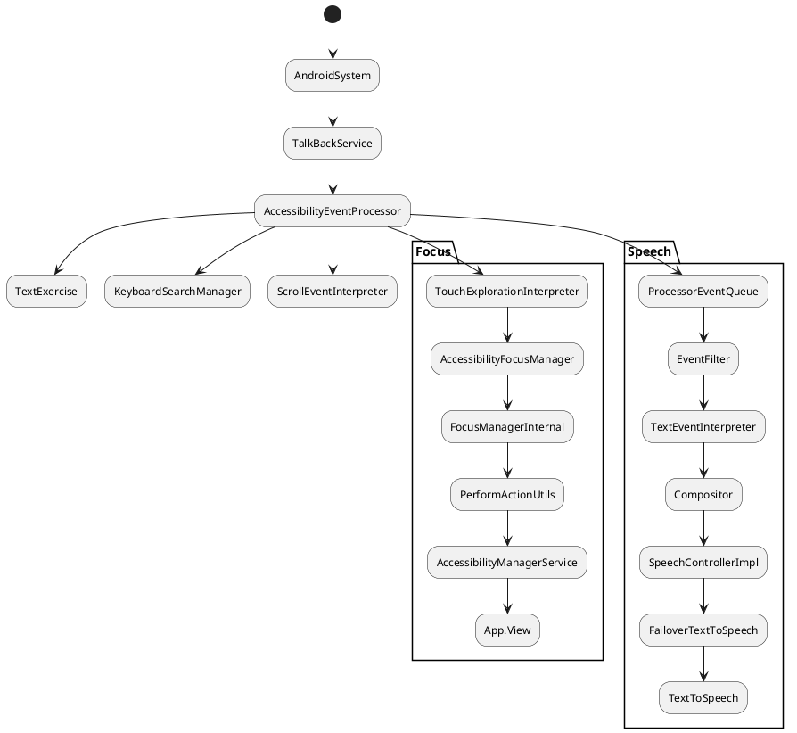

下图是 AccessibilityManagerService 把 AccessibilityEvent 发送给 TalkBackService 之后的流程。TalkBackService 对于每一个收到的事件，都会使用各种处理器去处理。这里我们只把焦点处理(Focus)和语音输出(Speech)两种处理器的处理流程画出来了。



当 TalkBackService 收到 AccessibilityEvent 的时候，直接交给 AccessibilityEventProcessor 处理。AccessibilityEventProcessor 是用来收集 AccessibilityEventListener 的容器，它会调用每一个 AccessibilityEventListener 去处理这个这个 Event。

<!-- more -->

## 源码解析


从 ，我知道 AccessibilityService 的入口函数是 onAccessibilityEvent，因此我们从 TalkBackService 的这个方法开始。

1. TalkBackService.onAccessibilityEvent()

    ```java
    @Override
    public void onAccessibilityEvent(AccessibilityEvent event) {
        Performance perf = Performance.getInstance();
        EventId eventId = perf.onEventReceived(event);
        mAccessibilityEventProcessor.onAccessibilityEvent(event, eventId);
        perf.onHandlerDone(eventId);
    }
    ```

    这里的 Performance 跟事件记录统计有关，可以从 TalkBack -> Settings -> Developer Settings -> Enable performance statistics 打开，但是没找到怎么样把数据打印出来😳。谁知道的麻烦告诉我一下。

    然后直接调用 AccessibilityEventProcessor 的 onAccessibilityEvent 方法。

2. AccessibilityEventProcessor.onAccessibilityEvent()

    ```java
    public void onAccessibilityEvent(AccessibilityEvent event, EventId eventId) {
      ...
      if (event.getEventType() == AccessibilityEvent.TYPE_WINDOW_STATE_CHANGED) {
        mLastWindowStateChanged = SystemClock.uptimeMillis();
      }
      if (event.getEventType() == AccessibilityEvent.TYPE_WINDOW_CONTENT_CHANGED
          || event.getEventType() == AccessibilityEvent.TYPE_WINDOW_STATE_CHANGED
          || event.getEventType() == AccessibilityEvent.TYPE_WINDOWS_CHANGED) {
        mService.setRootDirty(true);
      }
      // We need to save the last focused event so that we can filter out related selected events.
      if (event.getEventType() == AccessibilityEvent.TYPE_VIEW_FOCUSED) {
        if (mLastFocusedEvent != null) {
          mLastFocusedEvent.recycle();
        }
        mLastFocusedEvent = AccessibilityEvent.obtain(event);
      }
      if (AccessibilityEventUtils.eventMatchesAnyType(event, MASK_DELAYED_EVENT_TYPES)) {
        mHandler.postProcessEvent(event, eventId);
      } else {
        processEvent(event, eventId);
      }
      if (mTestingListener != null) {
        mTestingListener.afterAccessibilityEvent(event);
      }
    }
    private void processEvent(AccessibilityEvent event, EventId eventId) {
      // Send events to the only those processors which handle them.
      for (AccessibilityEventListener eventProcessor : mAccessibilityEventListeners) {
        int eventTypesHandled = eventProcessor.getEventTypes();
        if (AccessibilityEventUtils.eventMatchesAnyType(event, eventTypesHandled)) {
          eventProcessor.onAccessibilityEvent(event, eventId);
        }
      }
    }
    ```

    如果收到 TYPE_WINDOW_CONTENT_CHANGED，TYPE_WINDOW_STATE_CHANGED，TYPE_WINDOWS_CHANGED 事件，会将 mRootNode 设置为已过期，下次调用 getRootInActiveWindow() 时，重新获取 mRootNode。

    记录最后一个 focused 的事件。

    然后调用 AccessibilityEventListener 对象对事件进行处理，实现这个接口的对象很多，有 AccessibilityFocusManager、FocusProcessor、ProcessorEventQueue 等，我们先来看看这个接口

3. AccessibilityEventListener

    ```java
    public interface AccessibilityEventListener {
      /** @return mask of the events to be handled. */
      int getEventTypes();
      /**
       * <b>Note:</b> This method receives the events that are specified in the mask returned by {@link
       * #getEventTypes()} method.
       */
      void onAccessibilityEvent(AccessibilityEvent event, EventId eventId);
    }
    ```

    这个接口有个 getEventTypes() 方法，说明这个 Listener 能够处理的 Event 类型的集合。当传入的 AccessibilityEvent 的类型包含在 EventTypes 集合中，才会调用它的 onAccessibilityEvent() 方法。

后面的博客中将会分析 ProcessorEventQueue 和 TouchExplorationInterpreter 这两个 listener，这两个处理器的作用分别是控制语音的输出和焦点的控制。


